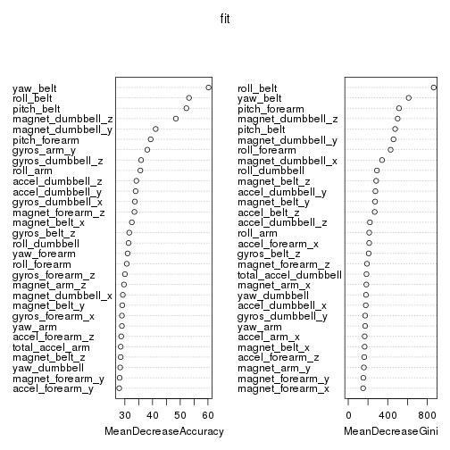

Predicting weight lifting performance
=======================================


```r
suppressPackageStartupMessages(library(dplyr))
suppressPackageStartupMessages(library(caret))
suppressPackageStartupMessages(library(randomForest))

df = read.csv("pml-training.csv", sep = ",", na.strings = c("", " ", "NA", "#DIV/0!"))
test = read.csv("pml-testing.csv", sep = ",", na.strings = c("", " ", "NA", "#DIV/0!"))
```

### Feature selection
Original dataset contains 160 columns and is plagued by NA values, expressed as "NA", "" and "#DIV/0!". By inspecting the features, there are a number of features that are computed over a window of time (such as kurtosis, avg, max etc of original measurements), while other features are direct measurements of sensors on belt, arm, forearm and dumbbell. The feature "new_window" with values "yes" (406 values) or "no" indicates whether the observation is a direct measurement or a window measurement. I counted the number of missing values per column and saw there is a cutoff at 406 between precisely those features that had no missing values (60 columns) and those that were computed for newwindow="yes" such as kurtosis etc.  

There are 52 features that are actually recorded for every observation from sensors, and these are: 
{gyros, magnet, accel} x {belt, arm, forarm, dumbbell} x {x,y,z} (every combination of these makes 3x4x3=36 features) and {pitch, yaw, roll, total_accel} x {belt, arm, forarm, dumbbell} (every combination of these makes 4x4=16 features). This finishes feature selection. 

```r
names = colnames(df)
sum(df$new_window == "yes")
```

```
## [1] 406
```

```r
features = apply(df, 2, function(x){sum(!is.na(x))}) > 406  ### select features without NA
subdf = df[features]
subdf = subdf[subdf$new_window == "no",8:60]
names[features][8:60]
```

```
##  [1] "roll_belt"            "pitch_belt"           "yaw_belt"            
##  [4] "total_accel_belt"     "gyros_belt_x"         "gyros_belt_y"        
##  [7] "gyros_belt_z"         "accel_belt_x"         "accel_belt_y"        
## [10] "accel_belt_z"         "magnet_belt_x"        "magnet_belt_y"       
## [13] "magnet_belt_z"        "roll_arm"             "pitch_arm"           
## [16] "yaw_arm"              "total_accel_arm"      "gyros_arm_x"         
## [19] "gyros_arm_y"          "gyros_arm_z"          "accel_arm_x"         
## [22] "accel_arm_y"          "accel_arm_z"          "magnet_arm_x"        
## [25] "magnet_arm_y"         "magnet_arm_z"         "roll_dumbbell"       
## [28] "pitch_dumbbell"       "yaw_dumbbell"         "total_accel_dumbbell"
## [31] "gyros_dumbbell_x"     "gyros_dumbbell_y"     "gyros_dumbbell_z"    
## [34] "accel_dumbbell_x"     "accel_dumbbell_y"     "accel_dumbbell_z"    
## [37] "magnet_dumbbell_x"    "magnet_dumbbell_y"    "magnet_dumbbell_z"   
## [40] "roll_forearm"         "pitch_forearm"        "yaw_forearm"         
## [43] "total_accel_forearm"  "gyros_forearm_x"      "gyros_forearm_y"     
## [46] "gyros_forearm_z"      "accel_forearm_x"      "accel_forearm_y"     
## [49] "accel_forearm_z"      "magnet_forearm_x"     "magnet_forearm_y"    
## [52] "magnet_forearm_z"     "classe"
```

### Applying Random Forests to the dataset
Random forests are very successful machine learning algorithm and my first choice. First we split the data set into a training (70%) and testing portion (30%).  I tried caret function train(classe ~ . , data = training, method = "rf") from the caret package, but it was too slow. The forum posters suggested using "randomForest" package directly - this drammatically improved performance.

```r
inTrain = createDataPartition(y = subdf$classe, p = 0.7, list = FALSE)
training = subdf[inTrain, ]
testing = subdf[-inTrain, ]
#modFit = train(classe ~ . , data = training, method = "rf", prox = TRUE) # too slow!!!
set.seed(1234)
fit = randomForest(classe ~ . , data = training, importance = TRUE)
print(fit)
```

```
## 
## Call:
##  randomForest(formula = classe ~ ., data = training, importance = TRUE) 
##                Type of random forest: classification
##                      Number of trees: 500
## No. of variables tried at each split: 7
## 
##         OOB estimate of  error rate: 0.58%
## Confusion matrix:
##      A    B    C    D    E class.error
## A 3824    5    0    0    1 0.001566580
## B   10 2584    9    0    0 0.007299270
## C    0   13 2330    4    0 0.007243289
## D    0    0   29 2172    2 0.014071720
## E    0    0    1    4 2465 0.002024291
```
So, randomForest does wonderfully well on this data set, with predicted out-of-sample error estimate of only about 0.5%. Indeed, the model scored 20/20 on the test cases in the project. 

### Predicting out-of-sample error
Random forest algorithm actually has an in-built OOB error estimate, because the algorithm randomly chooses a subsample of the original data and a number of features (typically square root of n=52). Thus, it can use the observations not used on training a particular tree in estimating the out-of-samp estimate. However, we will, just for completeness, apply the model to the testing portion of the dataset, as this is something normally used with any machine-learning algorithm: 

```r
pp = predict(fit, newdata = testing[,-53])
confusionMatrix(pp, testing[,53])
```

```
## Confusion Matrix and Statistics
## 
##           Reference
## Prediction    A    B    C    D    E
##          A 1639    4    0    0    0
##          B    2 1109    9    0    0
##          C    0    2  994    7    0
##          D    0    0    2  936    3
##          E    0    0    0    1 1055
## 
## Overall Statistics
##                                           
##                Accuracy : 0.9948          
##                  95% CI : (0.9926, 0.9965)
##     No Information Rate : 0.2847          
##     P-Value [Acc > NIR] : < 2.2e-16       
##                                           
##                   Kappa : 0.9934          
##  Mcnemar's Test P-Value : NA              
## 
## Statistics by Class:
## 
##                      Class: A Class: B Class: C Class: D Class: E
## Sensitivity            0.9988   0.9946   0.9891   0.9915   0.9972
## Specificity            0.9990   0.9976   0.9981   0.9990   0.9998
## Pos Pred Value         0.9976   0.9902   0.9910   0.9947   0.9991
## Neg Pred Value         0.9995   0.9987   0.9977   0.9983   0.9994
## Prevalence             0.2847   0.1935   0.1744   0.1638   0.1836
## Detection Rate         0.2844   0.1924   0.1725   0.1624   0.1831
## Detection Prevalence   0.2851   0.1943   0.1740   0.1633   0.1832
## Balanced Accuracy      0.9989   0.9961   0.9936   0.9952   0.9985
```
So, the out-of-sample error is about 0.5%. In other runs, the out-of-sample error was varying, but never more than 1%. In general, error on the testing set is expected to be higher than the estimate, as testing cases are completely new to the algorithm. 

Note that normally we would have to divide the training set into k folds or apply the leave-one-out algorithm in order to predict the out-of-sample error rate (which we then check on computing the error rate on the testing set). However, here we have that estimate for free, as explained above, because of how random forest works. 

### Obtaining predictions on the testing set (20 predictions)


```r
test_proj = test[,features][8:60]  # projecting the pml-testing.csv on our features
answers = predict(fit, newdata = test_proj[,-53]) #getting my predictions
```
These scored 20/20. 

### Plots

Here is an interesting plot that shows which features are the most important ones for prediction: 

```r
varImpPlot(fit)
```

 
